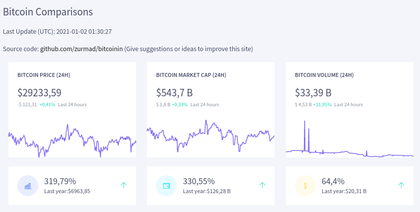

# BitcoinIN - Web

[](https://travis-ci.com/ZurMaD/bitcoinin)


<br />
<p align="center">
  <a href="#">
    
  </a>

  <h3 align="center">Bitcoin in ... <br>
  (Stocks, money, ...)</h3>

  <p align="center">
    <br />
    <a href="https://bitcoinin.herokuapp.com">View Demo</a>
  </p>
</p>

<hr style="height:2px;border-width:0;color:gray;background-color:gray">



<hr style="height:2px;border-width:0;color:gray;background-color:gray">

<!-- TABLE OF CONTENTS -->
<!-- ## Table of Contents -->


<!-- ABOUT THE PROJECT -->
## About The Project

Represent the growth of Bitcoin.

List of cards:

1. Bitcoin Price (24H)
2. Bitcoin Market Cap (24H)
3. Bitcoin Volume (24H)
4. Comparison with last year (1yo)
5. Bitcoin listed as company by market cap
6. Bitcoin listed as currrency by market cap

Sources: fiatmarketcap, companiesmarketcap, coingecko

## Install

### Local


```
sudo apt-get install python3-lxml
```

```
# Clone, install dependencies and run
git clone https://github.com/ZurMaD/bitcoinin
cd bitcoinin
pip3 install -r requirements.txt
python3 bitcoinin/manage.py runserver
```

### On Heroku

```
curl https://cli-assets.heroku.com/install.sh | sh # heroku install
heroku login
# Login here with browser
heroku buildpacks:add --index 1 heroku-community/apt -a NAME_OF_YOUR_APP
# Then connect your github repository to heroku and that's it.
```


### On Docker (comming soon)

```
...
```